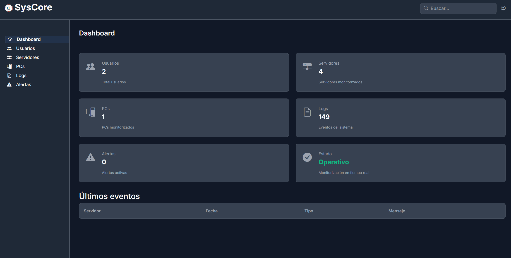
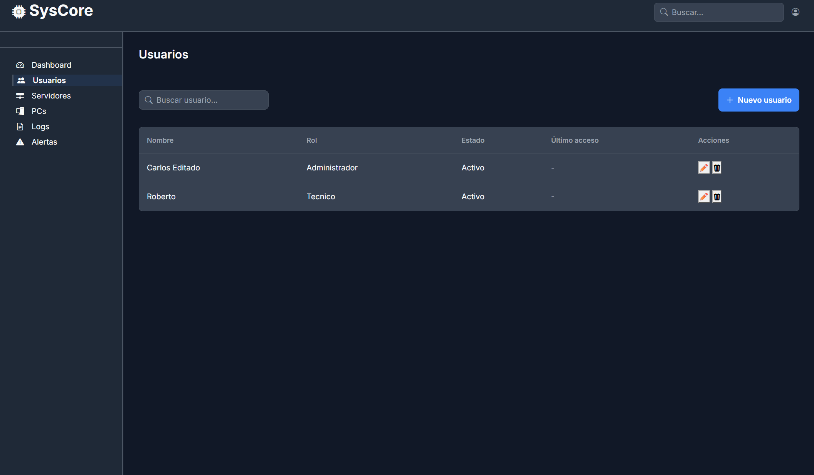
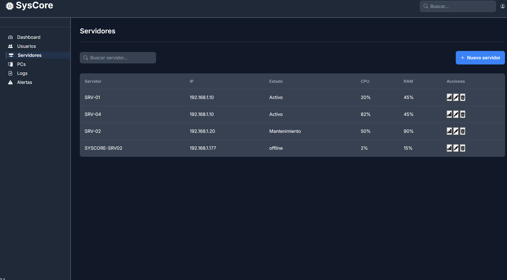
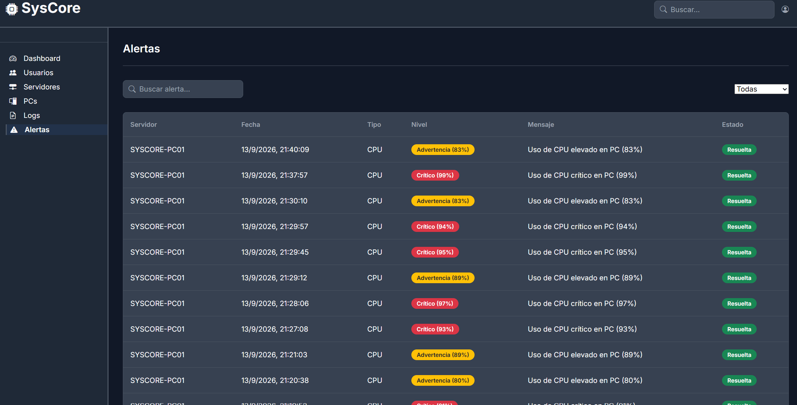
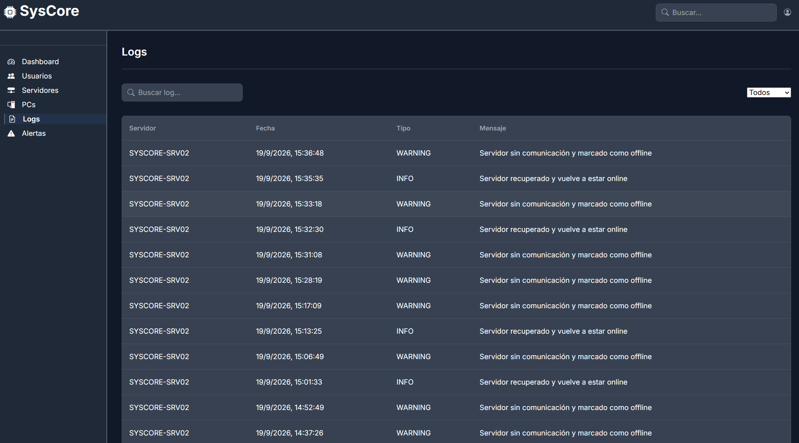
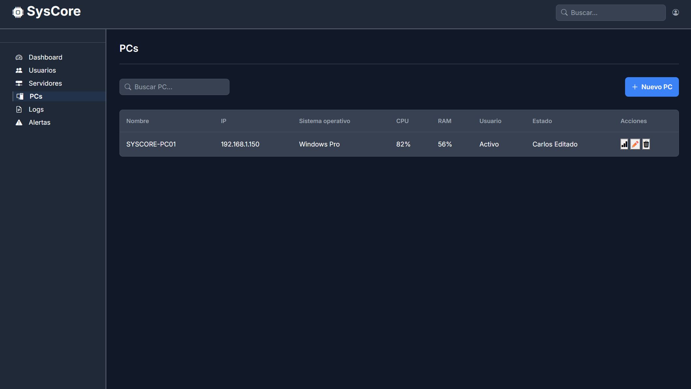
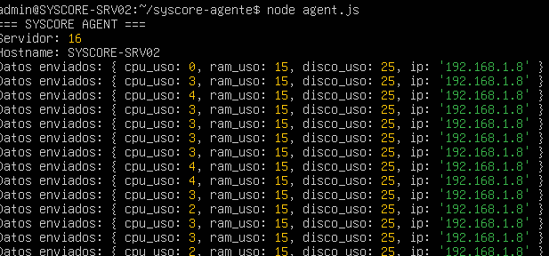

# ⚙️ SysCore

## IT Infrastructure Monitoring & Management Platform

**Automatiza. Administra. Resuelve.**

SysCore es una plataforma de monitorización y administración de infraestructura desarrollada como proyecto personal para centralizar la información de servidores y equipos dentro de un entorno Windows/Linux.

La plataforma recopila métricas de los equipos monitorizados, registra eventos y permite consultar el estado de la infraestructura desde una interfaz web.

> 🚧 **Estado actual: V2 — entorno de laboratorio/local**

---

## 📌 Características

* 📊 Dashboard de monitorización
* 🖥️ Gestión de servidores
* 💻 Gestión de PCs
* 👤 Gestión de usuarios
* 📈 Monitorización de CPU
* 🧠 Monitorización de RAM
* 💽 Monitorización de disco
* 📊 Visualización de Métricas del Sistema   
* 🚨 Sistema de alertas
* 📋 Registro y consulta de logs
* 🤖 Agente de monitorización para Linux
* 🔄 Envío periódico de métricas mediante API REST
* ⚙️ Ejecución automática del agente mediante `systemd`
* 🗄️ Persistencia de información mediante PostgreSQL

---

## 🏗️ Arquitectura

La V2 funciona actualmente dentro de una red local de laboratorio.

```text
                         ┌──────────────────────┐
                         │       Frontend       │
                         │      HTML / CSS      │
                         │     JavaScript       │
                         └──────────┬───────────┘
                                    │
                                    │ REST API
                                    ▼
                         ┌──────────────────────┐
                         │       Backend        │
                         │       Node.js        │
                         │       Express        │
                         └──────────┬───────────┘
                                    │
                                    ▼
                         ┌──────────────────────┐
                         │      PostgreSQL      │
                         │       Database       │
                         └──────────────────────┘
                                    ▲
                                    │
                              REST API
                                    │
                       ┌────────────┴────────────┐
                       │                         │
              ┌────────▼────────┐       ┌────────▼────────┐
              │    Linux VM     │       │    Linux VM     │
              │ SysCore Agent   │       │ SysCore Agent   │
              └─────────────────┘       └─────────────────┘
```

### Flujo de monitorización

```text
Linux Server
     │
     │ CPU / RAM / Disco / IP
     ▼
SysCore Agent
     │
     │ HTTP POST
     ▼
Node.js API
     │
     ▼
PostgreSQL
     │
     ▼
Web Dashboard
```

---

## 🛠️ Tecnologías

### Frontend

* HTML5
* CSS3
* JavaScript
* Bootstrap
* Bootstrap Icons
* Chart.js

### Backend

* Node.js
* Express
* REST API
* CORS

### Base de datos

* PostgreSQL
* pgAdmin

### Agente

* Node.js
* Axios
* Linux
* `systemd`

---

## 📂 Estructura del proyecto

```text
SysCore/
│
├── backend/
│   ├── config/
│   ├── routes/
│   ├── utils/
│   ├── server.js
│   ├── package.json
│   └── package-lock.json
│
├── frontend/
│   ├── agente/
│   │   ├── agent.js
│   │   ├── package.json
│   │   └── package-lock.json
│   │
│   ├── assets/
│   ├── css/
│   ├── js/
│   └── index.html
│
├── docker/
├── docs/
│   ├── screenshots/
│   └── PRODUCT_VISION.md
│
├── .gitignore
├── README.md
└── ROADMAP.md
```

---

## 🚀 Instalación

### Requisitos

* Node.js 18+
* npm
* PostgreSQL
* Linux para ejecutar el agente
* Windows/Linux como entorno de laboratorio

---

## 🗄️ Configuración de PostgreSQL

Crear una base de datos PostgreSQL llamada:

```text
Syscore
```

La configuración local utiliza:

```text
Host: localhost
Port: 5432
Database: Syscore
User: postgres
```

La contraseña debe configurarse localmente.


---

## ▶️ Ejecutar el backend

Entrar en:

```bash
cd backend
```

Instalar dependencias:

```bash
npm install
```

Iniciar el servidor:

```bash
node server.js
```

El backend utiliza el puerto:

```text
3000
```

Cuando se inicia correctamente:

```text
Servidor iniciado en http://localhost:3000
```

---

## 🌐 Frontend

El frontend se encuentra dentro de:

```text
frontend/
```

La interfaz utiliza JavaScript para comunicarse con la API REST del backend.

Actualmente las peticiones están configuradas para ejecutarse contra:

```text
http://localhost:3000
```

Por tanto, la V2 está pensada para ejecutarse dentro del entorno local de laboratorio.

---

## 🤖 SysCore Agent

El agente Linux recopila información del sistema:

* CPU
* RAM
* Disco
* Dirección IP
* Hostname

Cada 10 segundos envía las métricas al backend.

Ejemplo:

```text
{
    cpu_uso: 24,
    ram_uso: 41,
    disco_uso: 25,
    ip: "192.168.1.7"
}
```

### Ejecutar manualmente

```bash
cd frontend/agente
npm install
node agent.js
```

Salida esperada:

```text
=== SYSCORE AGENT ===
Servidor: 16
Hostname: SYSCORE-SRV02
Datos enviados: {
    cpu_uso: 1,
    ram_uso: 15,
    disco_uso: 25,
    ip: '192.168.1.7'
}
SysCore: Métricas actualizadas correctamente
```

---

## ⚙️ Inicio automático del agente

En Linux el agente puede ejecutarse como servicio `systemd`.

Activar el servicio:

```bash
sudo systemctl enable syscore-agente
```

Iniciar:

```bash
sudo systemctl start syscore-agente
```

Comprobar estado:

```bash
sudo systemctl status syscore-agente
```

Consultar logs:

```bash
sudo journalctl -u syscore-agente -f
```

De esta forma el agente se inicia automáticamente cuando arranca la máquina Linux.

---

## 📊 Monitorización

El agente envía periódicamente las métricas al backend mediante una petición HTTP.

Las métricas recibidas se almacenan en PostgreSQL y posteriormente son utilizadas por la plataforma para mostrar:

* Uso de CPU
* Uso de RAM
* Uso de disco
* Estado del servidor
* Histórico de métricas

---

## 🚨 Alertas

SysCore dispone de un sistema de alertas asociado al estado de la infraestructura.

Las alertas permiten identificar situaciones que requieren atención, como:

* Uso elevado de recursos
* Servidores sin comunicación
* Cambios de estado
* Eventos registrados por el sistema

El backend también comprueba periódicamente si un servidor deja de enviar métricas y puede marcarlo como `offline`.

---

## 📋 Logs

La plataforma registra eventos de infraestructura y permite consultarlos desde el apartado **Logs**.

Los eventos incluyen información como:

```text
Servidor
Fecha
Tipo
Mensaje
```

Tipos utilizados:

```text
INFO
WARNING
ERROR
```

---

## 📸 Capturas

### Dashboard



### Usuarios



### Servidores



### Alertas



### Logs



### PCs



### Agente Linux



> Si alguna captura todavía no está disponible, puede eliminarse temporalmente su referencia del README.

---

## 🔐 Seguridad

La V2 está diseñada principalmente como un entorno de laboratorio.

Antes de desplegar SysCore en Internet deberían implementarse medidas adicionales como:

* Gestión de secretos mediante variables de entorno
* Hash seguro de contraseñas
* Autenticación y autorización robustas
* HTTPS
* Gestión segura de sesiones/tokens
* Firewall
* Validación y sanitización de entradas
* PostgreSQL protegido
* Control de acceso a la API

Las credenciales reales y archivos de configuración privados no deben almacenarse en el repositorio.

---

## 🗺️ Roadmap

### V2 — Local Monitoring

* [x] Dashboard
* [x] Gestión de usuarios
* [x] Gestión de servidores
* [x] Gestión de PCs
* [x] Monitorización CPU
* [x] Monitorización RAM
* [x] Monitorización de disco
* [x] Histórico de métricas
* [x] Sistema de alertas
* [x] Sistema de logs
* [x] Agente Linux
* [x] API REST
* [x] PostgreSQL
* [x] Ejecución automática mediante systemd

---

## 🎯 Objetivo del proyecto

SysCore nace como un proyecto práctico para aprender y aplicar conceptos relacionados con:

* Administración de sistemas
* Monitorización de infraestructura
* Desarrollo backend
* APIs REST
* Bases de datos
* Linux
* Automatización
* Servicios `systemd`
* Desarrollo frontend
* Arquitectura de sistemas

La evolución prevista es pasar de un entorno de laboratorio local a una plataforma capaz de monitorizar infraestructura distribuida de forma remota.

---

## 📄 Estado del proyecto

**SysCore V2*

Proyecto en desarrollo.

La versión actual está orientada a pruebas y monitorización dentro de una red local.

La exposición pública de la plataforma y el despliegue remoto forman parte de la planificación de V3.
